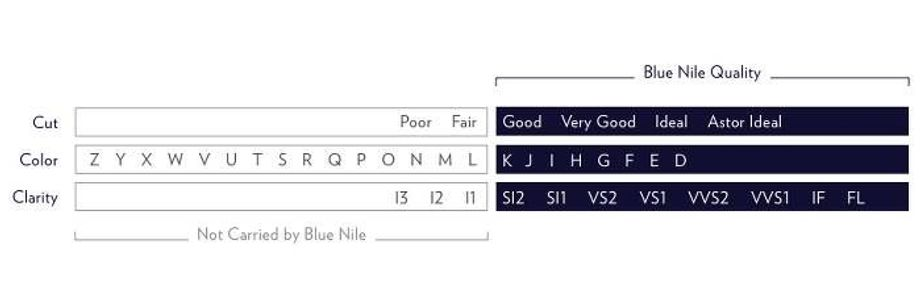

```{r setup, include=FALSE}
knitr::opts_chunk$set(echo = FALSE)
```

# Setup

```{r}
library(tidyverse)
library(MASS)
library(faraway)

Data <- read.csv("diamonds4.csv",header=T)
head(Data)
```

# Section 1: High Level Results of the Analysis

Our report studied the relationship between various factors associated with the grading of diamonds and the price of the diamonds. We found that the carat weight, a carat being roughly equal to 0.2 grams, is the most important factor in determining the price of the diamond. Thus, we analyzed the relationship between the carat weight of the diamond and its price. We found that, if the carat weight of a diamond increases by 1%, then the price of the diamond will increase by between 1.92% and 1.97%.

# Section 2: Data Description

The information in this section mostly comes from the following source:

Blue Nile. "The 4Cs of Diamonds," n.d. <https://www.bluenile.com/education/diamonds>.

## Dataset Variables

The quality, and consequently cost, of diamonds is measured with the "4Cs of Diamonds": the `cut`, `color`, `clarity`, and `carat` weight, which all appear in the dataset, along with the variable `price`.

The `cut` of a diamond measures how "well-proportioned a diamond's dimension are", as well as, once being processed, the "balance and brilliance of its facets". The facets of a diamond are the sides which are formed on the diamonds surface to give it its reflective, glittery appearance. The `color` of a diamond refers to the colorlessness of the diamond. Diamonds can often be yellowish, or off-white, depending on impurities in the source material. Therefore, the purest of diamonds are the ones which are completely colorless. The `clarity` of a diamond measures the cloudiness or impurities that can occur during diamond formation, due to impurities or foreign material. The `carat` weight refers to the physical weight of the diamond, and is often the most important indicator for showing how large, and subsequently how valuable, a diamond is. One carat is roughly equivalent to 0.2 g, or 0.00705 oz. Finally, the `price` refers to the price that the particular diamond sold for.

## Created Variables

During the analysis portion, we had to create a few new variables, namely `xstar` ($x^*$) and `ystar` ($y^*$). The variable `xstar` is the log of the `carat` variable, calculated as $x^* = ln(carat)$. The variable `ystar` is the log of the `price` variable, similarly calculated as $y^* = ln(price)$

## Visualizations and Descriptions

To better understand how `price` is related to the other variables in the dataset we will create visualizations to see the appropriate scatterplots and boxplots of the price in relation to the variables `carat`, `clarity`, `color`, and `cut`. These graphs will give us an understanding of how the price changes with increasing measures of quality. The increase in quality, both for numeric and categorical data, can be seen on the following scale, provided once again by BlueNile:

{#scale}

### Price vs. Carat Weight

```{r}
ggplot(Data, aes(x=carat, y=price)) + 
  geom_point() + 
  labs(x = "Carat Weight", y = "Price of Diamond", title = "Price of Diamond vs. Carat Weight")
```

We can see from this scatterplot that the relationship between the price of a diamond and the carat weight appears exponential of some sort. As the carat weight increases, the price substantially increases.The carat wight is the only numeric variable in the dataset other than price, and this method of using a scatterplot allows us to clearly see an upwards trajectory in the relationship between the carat weight and the price.

### Price vs. Clarity

In order to order the categories for `clarity` to match the given scale, we had to do some data manipulation to refactor the levels of the variable. We also created a new dataframe, where the data for diamonds were grouped by the clarity factor, and the median of the price was taken for each group. We plotted both boxplots of the `price` vs. the `clarity`, as well as bar plots of the median `price` vs. `clarity`. These plots will give us an idea about how `price` is related to `clarity`. The associated plots are:

```{r}
# Code to relevel the clarity factors from lowest-clarity to highest-clarity
Data <- Data %>% 
  mutate(clarity = clarity %>% fct_relevel(c("SI2", "SI1", "VS2", "VS1", "VVS2", "VVS1", "IF", "FL")))

# Code to groupby the clarity and find the median value of the diamonds in that clarity level. 
data.clarity <- Data %>% 
  group_by(clarity) %>% 
  summarize(median_price_clarity = median(price))

# Bar plot
ggplot(data.clarity, aes(x = clarity, y=median_price_clarity)) + 
  geom_bar(stat = "identity") + 
  labs(x = "Clarity", y = "Median Price of Diamond", title = "Median Price of Diamond Based on Clarity")

# Boxplot
ggplot(Data, aes(x=clarity, y = price)) + 
  geom_boxplot() + 
  labs(x = "Clarity", y = "Price of Diamond", title = "Price of Diamond vs. Clarity")
```

As we can see from the barplot above, the price increases dramatically when the clarity reaches the level of FL, which is flawless. Therefore, we can see that the median price of the diamond is not particularly affected by the clarity. However, based on the boxplot, the upper end of the prices for each quality do appear to have an upwards trend.

### Price vs. Color

In order to order the categories for `color` to match the given scale, we had to do some data manipulation to refactor the levels of the variable. One note with the refactoring: when we refactored using all of the potential `color` levels, we received warnings that the color level `K` was not found in the data. Thus, we removed that level from the refactoring. We again created a new dataframe, where the data for diamonds were grouped by the `color` , and the median of the price was taken for each `color`. We plotted both boxplots of the `price` vs. the `color`, as well as bar plots of the median `price` vs. `color`. These plots will give us an idea about how `price` is related to `color`. The associated plots are:

```{r}
# Releveling the factors for color to match the increasing qualities from BlueNile
Data <- Data %>% 
  mutate(color = color %>% fct_relevel(c("J", "I", "H", "G", "F", "E", "D")))

# Code to group by color and find the median price of diamonds of each color
data.color <- Data %>% 
  group_by(color) %>% 
  summarize(median_price_color = median(price))

# Bar plot
ggplot(data.color, aes(x = color, y=median_price_color)) + 
  geom_bar(stat = "identity") + 
  labs(x = "Color", y = "Median Price of Diamond", title = "Median Price of Diamond Based on Color")

# Boxplot
ggplot(Data, aes(x=color, y = price)) + 
  geom_boxplot() + 
  labs(x = "Color", y = "Price of Diamond", title = "Price of Diamond vs. Color")
```

Based on the bar plot, we do not see much of a relationship between color and the price of the median diamond of each color. In fact, the highest median price for a diamond appears for the lowest color quality on the scale: `J`. Ignoring the median price for the color level `J`, there is a somewhat upwards trend, though. However, when looking at the boxplots, the upper end of the diamonds sold at each color appear to have an upwards trajectory. That being said, the color does not appear to be a major factor in determining the price of a diamond, but there is certainly a positive relationship between `color` and `price`.

### Price vs. Cut

In order to order the categories for `cut` to match the given scale, we had to do some data manipulation to refactor the levels of the variable. We once again created a new dataframe, where the data for diamonds were grouped by the `cut`, and the median of the price was taken for each group. We plotted both boxplots of the `price` vs. the `cut`, as well as bar plots of the median `price` vs. `cut`. These plots will give us an idea about how `price` is related to `cut`. The associated plots are:

```{r}
# Releveling the factors for color to match the increasing qualities from BlueNile
Data <- Data %>% 
  mutate(cut = cut %>% fct_relevel(c("Good", "Very Good", "Ideal", "Astor Ideal")))

# Code to group by color and find the median price of diamonds of each color
data.cut <- Data %>% 
  group_by(cut) %>% 
  summarize(median_price_cut = median(price))

# Bar plot
ggplot(data.cut, aes(x = cut, y=median_price_cut)) + 
  geom_bar(stat = "identity") + 
  labs(x = "Cut", y = "Median Price of Diamond", title = "Median Price of Diamond Based on Cut")

# Boxplot
ggplot(Data, aes(x=cut, y = price)) + 
  geom_boxplot() + 
  labs(x = "Cut", y = "Price of Diamond", title = "Price of Diamond vs. Cut")
```

In a pattern very similar to the last two variables, we see that the bar plot does not show much of an upwards trend in median prices based on the cut of the diamond. In fact, with the exception of the Astor Ideal cut, the median prices decline as the cut "improves". This trend continues when looking at the boxplot. There is no considerable upwards trend in even the upper end of prices as the cut of the diamonds improve. Based on this information, it appears that the cut is not a significant variable when it comes to determining the price of a diamond

Based on the analysis above, the variable that best appears to relate to the price of a diamond is its carat weight, which agrees with the claims made on the BlueNile diamond education page. We will use the carat weight variable as the predictor variable moving forward in our regressions. However, based on the exponential appearance of the graph, some data transformations may be needed.

# Section 4: Regression Description

First, we must take a look at the scatterplot of the response variable $price$ against the designated predictor variable $carat$.

```{r}
ggplot(Data,aes(x=carat,y=price)) + 
  geom_point() +
  geom_smooth(method = "lm", se=FALSE) +
  labs(title="Diamond Price vs. Carat Weight", x = "Carat Weight", y = "Price of Diamond")
```

The scatterplot comparing carat and price looks exponential rather than linear. This would indicate that a transformation is needed, likely a log transformation.

As a reminder, the regression assumptions are as follows:

```{=tex}
\begin{itemize}
  \item The residuals have mean 0.
  \item The errors have constant variance.
  \item The errors are independent.
  \item The errors are normally distributed
\end{itemize}
```
To confirm, we will take a look at the diagnostic plots.

```{r}
result <- lm(price ~ carat,data=Data)
par(mfrow = c(2, 2))
plot(result)
```

Based on the diagnostic plots as well as the Box-Cox plots, it seems that both regression assumptions 1 and 2 have been violated since the errors do not have mean 0 nor constant variance. The mean of the residuals appears to decrease, and the residuals appear to get more spread out. If both assumptions are violated, the best solution is to log transform both the x and y variables. The Box-Cox plot agrees with this since the confidence interval does not include 1, indicating the y variable must be transformed.

We will create the variable `xstar`, which is defined as $x^* = ln(carat)$ and the variable `ystar`, defined as $y^* = ln(price)$:

```{r}
ystar<-log(Data$price)
Data<-data.frame(Data,ystar)
xstar<-log(Data$carat)
Data<-data.frame(Data,xstar)
ggplot(Data,aes(x=xstar,y=ystar)) + geom_point()+
  geom_smooth(method = "lm", se=FALSE)
```

As we can see from this scatterplot, the relationship appears much more linear than the first scatterplot before. To be sure we have remediated the violations of the regression assumptions, we look at the diagnostic plots once more:

```{r}
result2 <- lm(ystar ~ xstar,data=Data)
par(mfrow = c(2, 2))
plot(result2)
acf(result2$residuals, main="ACF Plot of Residuals from Y* ~ X* Model")
```

After log transforming both the `x` and `y` variables, the diagnostic plots also pass the assumption, with errors appearing to have both a mean of 0 and constant variance. Further, the Q-Q plot shows that the residuals have a fairly normal distribution. Based on the ACF plot, we can also see that the errors are independent. Thus, all four regression assumptions are met.

So, our hypotheses are:

$H_0: \beta_1 = 0$

$H_0: \beta_1 \ne 0$

When we run the regression, we see:

```{r}
summary(result2)
```

Based on the results of the model with both the response and the predictor being log transformed, `xstar`, $x^* = ln(carat)$, is statistically significant with a p-value of $2.2\times 10^{-16}$ much lower than 0.05. This means that the log of carat is significant in predicting the log of the price of the diamond.

The regression equation is $ln(price) = 8.521 + 1.944ln(carat)$. This means that for every 1% increase in the carat weight, the price of the diamond is expected to increase by around 1.944%.

The 95% confidence interval is:

```{r}
confint(result2, level=0.95)
```

Which shows that we are 95% confident that for each 1% increase in the carat weight of a diamond, its price will increase between 1.92% and 1.97%.
